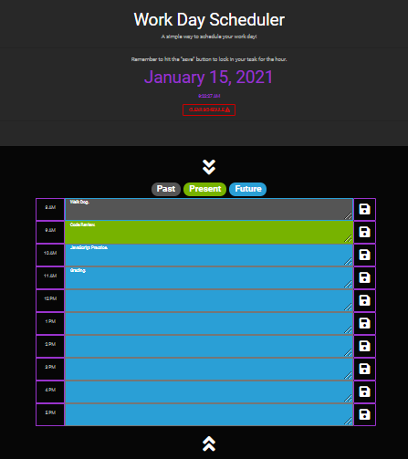

# Work-Day-Planner
[](https://github.com/jessicablank/Work-Day-Planner/stargazers)
[](https://github.com/jessicablank/Work-Day-Planner/network)
[](https://opensource.org/licenses/MIT)
[](https://github.com/jessicablank/Work-Day-Planner/issues)

Deployed on GitHub Pages: [https://jessicablank.github.io/Work-Day-Planner/](https://jessicablank.github.io/Work-Day-Planner/)

## Description:
A simple way to plan your workday! A coding boot camp homework assignment to practice jQuery, localStorage, and traversing HTML DOM elements. Refactored post-boot camp to play with [https://bootswatch.com](Bootswatch) and streamline the .js file while having fun with comments. 

## Table of Contents
* [Installation](#installation)
* [Project Story](#project-story)
* [Technologies Used](#technologies-used)
* [Questions](#questions)
* [License](#license-info)

## Installation Instructions
Fork, clone, or download and go! Ready to run in browser. 

## Project Story
> Sometimes it *clicks* during boot camp, sometimes it *clicks* after boot camp. 
*- My UCSD Extension Coding Boot Camp Instructor*

I often heard those wise words from my instructor ringing in my ears as I struggled through my home work assignments. This was one of them. With the help of classmates and Google I managed to make it work with a lot of code. I added a clear button just to prove that I had, in fact, learned something about localStorage. 

When I came back to this assignment I experienced one of those "click" moments my teacher described. My refactoring goals were to add new styling and eliminate the use of moment.js. As the code made more and more sense to me, I enthusiastically added detailed comments with ASCII faces to the app.js file ◕ ‿ ◕. 

### Styling Leads to Clarity
Every coding boot camper received the same CSS starter code, which means our day planners look exactly the same. 

 I used the [Bootswatch Cyborg Theme](https://bootswatch.com/cyborg/):robot: to create a dark theme. As I eliminated the provided CSS and added the Bootswatch themes, DOM manipulation really *clicked.* I could explain the intuitive parent-child-siblings relationships throughout boot camp, but I don't think I fully grasped that DOM elements can be accessed and manipulated just like array elements in an object until I was able to update the HTML text area via `this.children[1]` in app.js. 

Original app.js file used a data attribute to update the HTML classes: 
```
  var blockTime = $("#" + index).data("military");

  if (blockTime == milTime) {
    $("#" + index).addClass("present");
  } 
  ```
  Refactored uses DOM selectors and eliminates the need for a data attribute:
  ```
  let descriptionField = this.children[1];
   if (blockTime < currentHour) {
        $(descriptionField).addClass("bg-secondary text-white border-primary");
```

### localStorage 

This "ah-ha" moment helped me clean up other code in the app.js file. Most especially the way localStorage items are saved and retrieved. 

Original app.js contained an individual line of code to retrieve each hour-id in localStorage:
```
var nineAM = localStorage.getItem("9");
  $("#9").val(nineAM);

and so on...
```

A handy loop with DOM traversal allows for the addition of a new time blocks (like 8 AM) without more jQuery code:
```
 for (let i = 0; i < localStorage.length; i++) {
    let blockTimeId = localStorage.key(i);
    $(blockTimeId)
      .children(".description")
      .val(localStorage.getItem(localStorage.key(i)));
  }
```
### JavaScript Methods
I was also able to eliminate the use of moment.js as that library circles the depreciation drain. I am simply using [Javascript Date Objects](https://www.w3schools.com/js/js_dates.asp "Go to W3Schools") with a [Window setInterval](https://www.w3schools.com/jsref/met_win_setinterval.asp "Go to W3Schools") method to check the time every second. This seems like a light-weight solution for this simple browser app. 

### Iteration
I'm glad I have this has a reference point for future applications with similar functionality. At the same time I know if I come back to it in a few months, I'll likely have more ideas on how to make it better. This is the iterative cycle of learning to code (ﾉ◕ヮ◕)ﾉ*:･ﾟ✧

Screen Shot of Original:


Screen Shot of Refactored:



## Technologies Used
* [Bootswatch Cyborg Theme](https://bootswatch.com/cyborg/)
* [Font Awesome Icons](fontawesome.com)
* [GitHub Corners](https://tholman.com/github-corners/)
* [jQuery](https://jquery.com/)
* [localStorage](https://developer.mozilla.org/en-US/docs/Web/API/Window/localStorage)


## Questions
You can reach the author, Jessica Blankemeier, via [github](http://github.com/jessicablank) and [email](mailto:jessicablankemeier@gmail.com)


## License
Copyright 2020 - present Jessica Blankemeier.
This project is licensed under the terms of the MIT license. 
More information is available at [opensource.org/licenses](https://opensource.org/licenses/MIT)

[Back to top](#table-of-contents)


