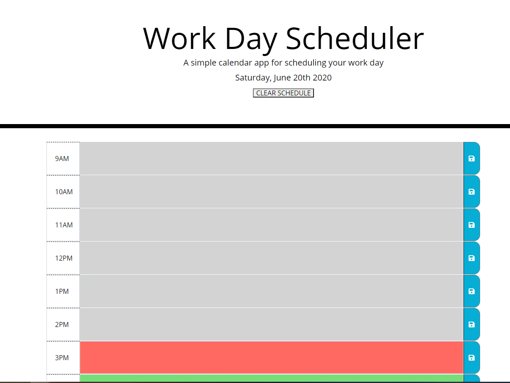

# Work-Day-Planner
A simple planner for your work day: 
[Git Hub Deployed Page Link](https://jessicablank.github.io/Work-Day-Planner/)

Screen Shot of deployed webpage:

Format: 

## Project Details
* GIVEN an HTML template for a day planner styled with CSS
* LINK to Jquery to meet the acceptance criteria below

## Acceptance Criteria
GIVEN I am using a daily planner to create a schedule

WHEN I open the planner
THEN the current day is displayed at the top of the calendar

WHEN I scroll down
THEN I am presented with timeblocks for standard business hours

WHEN I view the timeblocks for that day
THEN each timeblock is color coded to indicate whether it is in the past, present, or future

WHEN I click into a timeblock
THEN I can enter an event

WHEN I click the save button for that timeblock
THEN the text for that event is saved in local storage

WHEN I refresh the page
THEN the saved events persist

## Tests
* Is the screen mobile responsive?
* Does the clear button clear all data?
* Does task entered entered and saved persist after the page is refreshed?

##Resources
https://momentjs.com/
https://www.w3schools.com/bootstrap4/bootstrap_forms_input_group.asp

