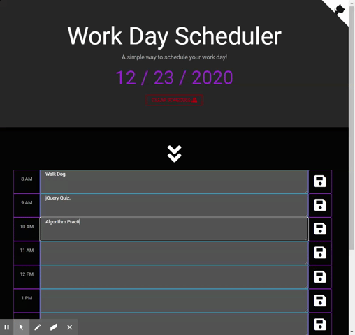

# Work-Day-Planner

Deployed on GitHub Pages: [https://jessicablank.github.io/Work-Day-Planner/](https://jessicablank.github.io/Work-Day-Planner/)

## Description:
A simple way to plan your workday! A coding boot camp homework assignment to practice jQuery, localStorage, and traversing HTML DOM elements. Refactored post-boot camp to play with [https://bootswatch.com](Bootswatch) and streamline the .js file. 

## Table of Contents
* [Installation](#installation)
* [Project Story](#project-story)
* [Technologies Used](#technologies-used)
* [Questions](#questions)
* [License](#license-info)

## Installation Instructions
Fork, clone, or download and go! Ready to run in browser. 

## Project Story
I came back to this one with simple goals. I wanted to add new styling and eliminate the use of moment.js. as the JavaScript library circles the depreciation drain. 

### Styling Leads to Clarity
Every boot camper received the same CSS starter code, which means our day planners look exactly the same. As I tinkered with the code to add class names from Bootswatch "Cyborg" theme :robot:, the object-oriented nature of HTML DOM elements became more obvious than ever. I know I could explain the intuitive parent-child-siblings relationships throughout boot camp, but I don't think I fully grasped that DOM elements can be accessed just like array elements in an object until I was able to update the HTML text area via `$(this.children[1])` in app.js.

This "ah-ha" moment helped me clean up other code in the app.js file. Most especially the way localStorage items are retrieved. I originally had an individual line of code to retrieve each hour-id in localStorage. A handy for loop with DOM traversal allowed for the addition of a new time block (8 AM) without more jQuery code.

### JavaScript Methods
I was also able to eliminate the use of moment.js as that library circles the depreciation drain. I am simply using Javascript date methods with a `setInterval` method to check the time every 15 seconds. This seems like a light-weight solution for this simple browser app. 

### Iteration
Going back over my homework assignments from boot camp is a great reminder that software development is a moving, iteration cycle. I'm glad I have this has a reference point for future applications with similar functionality. At the same time I know if I come back to it in a few months, I'll likely have more ideas on how to make it better. For now, I will mark in my Trello Board to make a ReactJS version of this application so I can dynamically add HTML time blocks.

Screen Shot of Original:

Gif of Refactored:

## Technologies Used
* [Bootswatch Cyborg Theme](https://bootswatch.com/cyborg/)
* [Font Awesome Icons](fontawesome.com)
* [GitHub Corners](https://tholman.com/github-corners/)
* [jQuery](https://jquery.com/)
* [localStorage](https://developer.mozilla.org/en-US/docs/Web/API/Window/localStorage)

## Questions
You can reach the author, Jessica Blankemeier, via [github](http://github.com/jessicablank) and [email](mailto:jessicablankemeier@gmail.com)

## License
Copyright 2020 - present Jessica Blankemeier.
This project is licensed under the terms of the MIT license. 
More information is available at [opensource.org/licenses](https://opensource.org/licenses/MIT);

